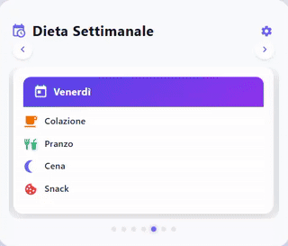

# 🥗 One State Packages - Diet package with Diet Card

A custom Lovelace card to manage and visualize the weekly diet directly from Home Assistant, and an interactive bot on Telegram to control the diet!

<table width="100%">
  <tr>
    <td align="center" width="50%"><strong>Full View</strong></td>
    <td align="center" width="50%"><strong>Compact View</strong></td>
  </tr>
  <tr>
    <td align="left">
      
    </td>
    <td align="right">
      
    </td>
  </tr>
</table>

## 🚀 Description

This package allows you to:
- Manage the daily and weekly diet through a modern and simple interface.
- Save and display daily meals (breakfast, lunch, dinner, snack).
- Manage the diet through a bot created by the package using Telegram Bot!

## 📂 Installation

### 1. Copy the files to your Home Assistant

- **diet_en.yaml**: in `config/packages/package_dieta/` (or other package directory)

### 2. Add the package to your configuration

In your `configuration.yaml` add (if not already present):

```yaml
homeassistant:
  packages: !include_dir_named packages
```

Make sure the package is loaded correctly.

### 3. Import the Lovelace Card
Automatic Installation:

***LINK HACS***

Manual Installation:
```yaml
resources:
  - url: /local/dieta-card.js
    type: module
```

## ⚙️ Configuration

1. **Load the `diet_en.yaml` package**
   - This file creates all the sensors, input_text and scripts needed to manage the diet.

2. **Customize the parameters**
   - The only required customization is your Telegram `chat_id`
     ```
     setting:
       chat_id telegram: &chat_id 1234567890 # <-------- Enter your chat_id here
     ```

3. **Add the card to the dashboard**
   - Go to Lovelace, choose "Add Card" → "Dieta Card":
   - Customize your diet using the visual editor.

## 📝 Editor Usage

- **Themes**: Choose your favorite theme among: `default`, `dark`, `pastel`, `neon`
- **Day Selection**: Select the day to be filled in.
- **Meal Input**: use the card to enter and save the meals of the day or the week.
- **Saving**: ⚠️ The "Save Day" and "Reset Day" buttons reset the text fields every time, so make sure to save your diet elsewhere first (e.g. in a text file), and then paste it back into the fields!
  Once the day is filled, press "Save Day" and it will appear in the card.

## 2️⃣ How to configure the Telegram bot

### a. Bot registration

1. Search for “@BotFather” on Telegram.
2. Start the chat and follow the instructions to create the bot.
3. Choose a name and a unique username for your bot.
4. Copy the **API Token** provided by BotFather (e.g.: `123456:ABC-DEF1234ghIkl-zyx57W2v1u123ew11`).

### b. Add the Telegram platform in Home Assistant

In your `configuration.yaml`:

```yaml
telegram_bot:
  - platform: polling
    api_key: YOUR_API_TOKEN
    allowed_chat_ids:
      - CHAT_ID
```

**Replace** `YOUR_API_TOKEN` with the token from BotFather.

### c. Find your Chat ID

- Search "@myidbot" on Telegram and type `/getid`, the bot will reply with your `chat_id`


## ❓ FAQ

**I can't see the card!**
- Make sure the JS resource is properly added to Lovelace.
- Check the syntax and make sure the package is loaded without errors.
- Clear the browser cache!

**The text is getting cut off or truncated**
- Home Assistant input_text fields have a 255 character limit by default.

**I'm not receiving messages on Telegram!**
- Make sure the "Telegram Bot" service is present, just go to Developer Tools - Services - Search for Telegram bot and try sending yourself a message like this:
  ```
  action: telegram_bot.send_message
  data:
    message: It works!
  ```
  If the message arrives, your Telegram Bot is configured correctly. Double check the chat_id in the package!

## 🤝 Support

For issues, open a GitHub issue [HERE]().
